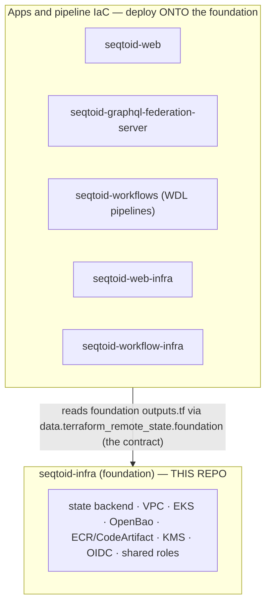

# seqtoid — Infrastructure Foundation (Infrastructure-as-Code)

The **foundation** layer of the seqtoid platform: the [Terraform](https://terraform.org)
Infrastructure-as-Code that provisions the shared, long-lived AWS infrastructure —
the remote-state backend, network, EKS cluster, secrets store (OpenBao), and
container/package registries — that **every other seqtoid repo builds on top of**.

> **seqtoid** is a hypothesis-free metagenomic pathogen-identification platform. This
> repo is **new in the platform overhaul** (greenfield — not a fork of the legacy
> setup) and sits at the **bottom of the stack**: nothing else can deploy until the
> foundation exists.

> **Naming:** the platform is being renamed to **seqtoid**, and the repositories are
> migrating to the `seqtoid-*` convention over time. This README uses the target names.
> Current → target mapping:
> `czid-infra` → `seqtoid-infra` (this repo) · `cypherid-web-infra` → `seqtoid-web-infra` ·
> `cypherid-workflow-infra` → `seqtoid-workflow-infra`. The `seqtoid-web`,
> `seqtoid-graphql-federation-server`, and `seqtoid-workflows` repos already use it.

---

## Why this repo exists

The legacy platform had infrastructure and Terraform/Terraform state scattered across
repos with no single, backed-up source of truth and lots of duplicated shared infra.
This repo fixes that by establishing **one foundation**:

- **One shared, backed-up state backend** — every repo's Terraform state lives in a
  single versioned, encrypted S3 bucket (one `key` per stack), so there's one place
  to secure, version, and back up.
- **One master "foundation" state** — owns the shared, long-lived infra (network,
  EKS, KMS, OpenBao, registries, GitHub OIDC, least-privilege roles) and **publishes
  it as a stable contract** (`outputs.tf`).
- **Inheritance, not duplication** — downstream stacks read those outputs via
  `terraform_remote_state`; they consume the foundation, they don't re-create it.

This contains blast radius (no monolithic state), keeps plans fast, and gives the
whole platform one secure, durable base.

---

## Where this repo fits in the platform



| Repo (target name) | Role | Relationship to the foundation |
|---|---|---|
| **seqtoid-infra** (this) | Foundation IaC | Provides the state backend + shared infra everything inherits |
| **seqtoid-web-infra** | IaC for the web app's AWS resources (Aurora, CDN, services) | Consumes foundation outputs; state in the shared backend |
| **seqtoid-workflow-infra** | IaC for the bioinformatics pipeline infra (Batch, Step Functions, Lambdas) | Consumes foundation outputs; state in the shared backend |
| **seqtoid-web** | Rails + React application | Deploys onto the foundation EKS; pulls images from its registries |
| **seqtoid-graphql-federation-server** | Node GraphQL federation server | Deploys onto the foundation EKS |
| **seqtoid-workflows** | WDL bioinformatics pipelines | Run on the workflow infra; images via the foundation registries |

---

## What it provisions

**State backend** (`infra/state-foundation/bootstrap/`) — the one-time chicken-and-egg
layer that creates the home for all state:
- Versioned, **SSE-KMS-encrypted**, TLS-only, public-access-blocked S3 bucket
  (`prevent_destroy`), bucket versioning = the backup (configurable retention).
- **Locking** — DynamoDB table *or* Terraform ≥ 1.10 native S3 locking (`use_lockfile`).
- Optional **DR** — S3 Cross-Region Replication to a second region.

**Foundation** (`infra/state-foundation/foundation/`) — the shared infra, as modules:
- **`network`** — the VPC / subnets / AZs.
- **`eks`** — the platform Kubernetes cluster (private API endpoint + SSM bastion,
  all five control-plane log types).
- **`openbao`** — [OpenBao](https://openbao.org) (open-source Vault) unseal infra for
  platform secrets.
- **`registries`** — ECR + CodeArtifact (with a pull-through cache) — the controlled
  homes for container images and npm/pip/etc. packages.
- A shared, rotated **application KMS key**, **GitHub OIDC**, and shared
  **least-privilege IAM roles**.

Everything in `foundation/` is exported through `foundation/outputs.tf` — **treat that
file as the platform's stable inheritance API.**

---

## Architecture — layered state + inheritance

One shared bucket, one state `key` per stack, with the foundation as the master that
publishes outputs:

```
   s3://<tfstate-bucket>-<acct>-<region>   (one shared, versioned, KMS-encrypted bucket)
   ├── foundation/terraform.tfstate         ← MASTER — owns shared infra, publishes outputs
   ├── apps/seqtoid-web/terraform.tfstate
   ├── apps/graphql-federation/terraform.tfstate
   ├── workflow-infra/terraform.tfstate
   └── …one key per stack, never shared…

   foundation ──outputs.tf──▶ data.terraform_remote_state.foundation ──▶ downstream stacks
```

> `terraform_remote_state` reads **outputs only**. If a downstream stack needs a value,
> the foundation must export it from `outputs.tf`.

See [`infra/state-foundation/README.md`](infra/state-foundation/README.md) for the full
model, backup/durability guarantees, and the bootstrap procedure.

---

## Repository layout

```
.
├── infra/state-foundation/
│   ├── README.md                 # the state model + bootstrap procedure (read this)
│   ├── backend.hcl               # shared S3 backend config (generated by bootstrap)
│   ├── bootstrap/                # one-time: creates the state bucket + lock + KMS (local backend)
│   ├── foundation/               # the MASTER state — shared infra
│   │   ├── main.tf, outputs.tf, variables.tf, versions.tf, backend.tf
│   │   └── modules/{network,eks,openbao,registries}/
│   └── consumers/seqtoid-web/    # EXAMPLE: how a downstream stack inherits foundation outputs
├── docs/                         # architecture, security findings & hardening (see below)
├── specs/                        # spec-kit specs for individual change slices
├── .github/workflows/            # terraform-ci.yml (fmt+validate gate) · security.yml (scanners)
├── .terraform-version             # pinned toolchain (1.12.1) — read by CI
├── .trivyignore                  # audited security-scan exceptions
├── renovate.json                 # automated dependency updates
└── TODO.md                       # outstanding foundation work
```

---

## How it interfaces with the other repos

1. **Shared state backend** — `bootstrap/` creates the S3 bucket + locking that holds
   *every* repo's Terraform state (one key per stack).
2. **Foundation outputs = the contract** — `foundation/outputs.tf` exposes VPC, EKS,
   registries, KMS, OIDC, and role ARNs. Downstream stacks read them with
   `data "terraform_remote_state" "foundation"` — see the worked example in
   [`infra/state-foundation/consumers/seqtoid-web/remote_state.tf`](infra/state-foundation/consumers/seqtoid-web/remote_state.tf).
3. **EKS** — the applications (`seqtoid-web`, `seqtoid-graphql-federation-server`)
   deploy onto the foundation's cluster (pull-based GitOps + blue/green promotion; see
   `docs/DEPLOYMENT-ARCHITECTURE.md`).
4. **Registries** — the `registries` module (ECR + CodeArtifact + pull-through cache) is
   where apps/pipelines push and pull images and packages; the app Dockerfiles' build
   hooks (`BASE_REGISTRY` / `NPM_REGISTRY`) are designed to proxy through it.
5. **OpenBao** — the platform's secrets store.
6. **Observability** — the platform OpenTelemetry + Prometheus/Loki/Grafana stack is
   hosted on the foundation EKS, so the foundation's own health must be observable first.

---

## Getting started

**Prerequisites:** Terraform **1.12.1** (pinned in `.terraform-version`; e.g.
`tofuenv install`), AWS credentials for the target account.

```bash
# 1) One-time: bootstrap the shared state backend (runs on a LOCAL backend)
cd infra/state-foundation/bootstrap
terraform init
terraform apply
terraform output backend_hcl > ../backend.hcl     # copy the generated backend config

# 2) The foundation (master state)
cd ../foundation
terraform init -backend-config=../backend.hcl
terraform plan      # review
terraform apply

# 3) Any downstream stack then inits against the shared backend and reads
#    foundation outputs via terraform_remote_state (see consumers/seqtoid-web/).
```

---

## Toolchain & conventions

- **Terraform 1.12.1**, pinned in `.terraform-version` and read by CI (single source of truth).
- **`.terraform.lock.hcl` is committed** per stack — providers are pinned and reproducible.
- **Renovate** keeps providers/actions current (`renovate.json`).
- **Small, single-concern PRs** traced to a tracking ticket; **validate locally**
  (`terraform fmt` + `terraform validate`) before pushing — CI is the final gate, not the dev loop.
- All work is authored by the team; commits/PRs carry **no AI attribution**.

## CI/CD

- **`terraform-ci.yml`** — `terraform fmt -check -recursive` + per-stack `terraform validate`
  (`init -backend=false`) on push/PR.
- **`security.yml`** — `gitleaks` (secrets, **hard-fail**) + `trivy` + `tflint` + `checkov`
  (config/policy), report-mode ratcheting to hard-fail as findings clear.
- Deploy/promotion gating (dev→staging→prod, approval on prod) is in progress;
  foundation-apply gating is being added.

## Security & hardening

- **Foundation hardening — done:** the greenfield Checkov pass (KMS key policies,
  DynamoDB CMK + PITR, S3 EventBridge notifications, DR S3 lifecycle, default-SG lockdown,
  all EKS control-plane log types). `terraform validate` + `fmt` clean.
- **EKS API endpoint → private** (with an SSM bastion + pull-based GitOps) — decided;
  in progress. The user-facing data plane stays on a public ALB Ingress.
- Findings and the hardening trail live in `docs/` (see below); audited scan exceptions
  in `.trivyignore`.

## Deployment model

The platform is designed for multiple editions (SaaS / MSP / on-prem **Appliance**) with a
private EKS control plane, **pull-based GitOps**, and **blue/green** promotion. See
[`docs/DEPLOYMENT-ARCHITECTURE.md`](docs/DEPLOYMENT-ARCHITECTURE.md).

## Documentation

| Doc | What |
|---|---|
| [`infra/state-foundation/README.md`](infra/state-foundation/README.md) | State model, durability/backup, bootstrap procedure |
| [`docs/DEPLOYMENT-ARCHITECTURE.md`](docs/DEPLOYMENT-ARCHITECTURE.md) | Editions, GitOps, blue/green, EKS topology |
| [`docs/SECURITY-001-FOUNDATION-HARDENING.md`](docs/SECURITY-001-FOUNDATION-HARDENING.md) | The foundation hardening pass + residual items |
| [`docs/SECURITY-SCANNING.md`](docs/SECURITY-SCANNING.md) | The gitleaks/Trivy/tflint/Checkov scanning setup |
| [`docs/SECURITY-FINDINGS-DETAILED.md`](docs/SECURITY-FINDINGS-DETAILED.md), [`docs/SECURITY-FINDINGS-2026-06-11.md`](docs/SECURITY-FINDINGS-2026-06-11.md) | The security-scan findings register |
| [`docs/BUG-INVENTORY.md`](docs/BUG-INVENTORY.md) | Catalogued issues |
| [`TODO.md`](TODO.md) | Outstanding foundation work |

## Status

Greenfield and **built**: the state backend + foundation (network / EKS / OpenBao /
registries / KMS / OIDC / roles) are in place and hardened, on Terraform 1.12.1 with a
green `fmt`+`validate` CI gate. Remaining work is tracked in `TODO.md` (private EKS
endpoint slice, residual S3/VPC logging, foundation-apply promotion gating). Part of the
broader seqtoid platform overhaul.
