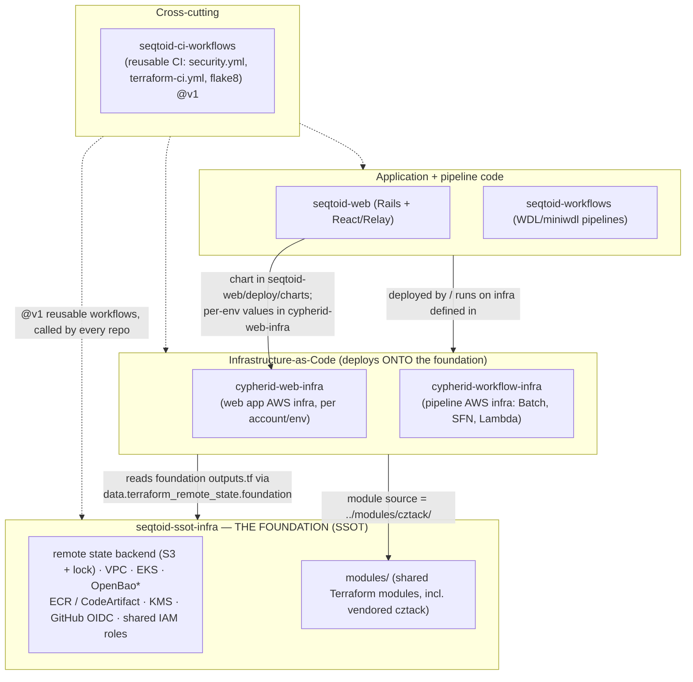

# 08 — Platform Architecture & the SSOT

The cross-repo picture a junior engineer needs **before** diving into any single repo:
how the repositories interrelate, where the single source of truth (SSOT) lives and how
consumers pin to it, how the four environments relate, and the end-to-end build → deploy
story. Read this alongside [BRANCHING-DEPLOY-MODEL.md](BRANCHING-DEPLOY-MODEL.md) and the
per-repo onboarding docs under [repos/](repos/); it goes one level deeper on the *seams
between* repos.

> **Grounded in current state.** NextGen/GraphQL federation is removed (Rails serves
> `/graphql` natively), the DB is MySQL 8, IaC is native **Terraform** (the OpenTofu
> migration was reverted), and secrets come from **Chamber/SSM** (not Vault — that path is
> held). Where a leg of the deploy path is not yet wired, it is marked **(not yet live)**.

---

## 1. How the repositories interrelate



`*` OpenBao is provisioned by the foundation but the **app secrets path is Chamber/SSM
today** (see §4); OpenBao/Vault adoption is held.

| Seam | What crosses it | Mechanism |
|---|---|---|
| foundation → IaC | network/EKS/registry/role IDs | `outputs.tf` read via `terraform_remote_state` (the **contract**) |
| foundation → all IaC | shared modules | `modules/cztack/<module>` (vendored, in-repo) |
| IaC → apps | where the app runs | EKS cluster + IRSA roles + ECR repos the app deploys into |
| app code → app infra | the running deployment | Helm chart (in `seqtoid-web`) + per-env values (in `cypherid-web-infra`) reconciled by Argo CD |
| every repo → CI | the CI gates | `seqtoid-ci-workflows/*@v1` reusable workflows |

## 2. Where the SSOT lives & how it works

**The SSOT is `seqtoid-ssot-infra`** (directory name; historically `czid-infra`). It sits
at the **bottom of the stack** — nothing else can deploy until it exists. It owns three
things every other repo consumes:

1. **One shared, backed-up state backend.** Every repo's Terraform state lives in a single
   versioned, SSE-KMS-encrypted, TLS-only, public-access-blocked S3 bucket
   (`prevent_destroy`), one `key` per stack, with a DynamoDB lock table (or native S3
   locking on Terraform ≥ 1.10). Provisioned by `infra/state-foundation/bootstrap/`.
2. **One master "foundation" state.** The shared, long-lived infra (VPC, EKS, KMS,
   OpenBao, ECR/CodeArtifact, GitHub OIDC, least-privilege roles), wired in
   `infra/state-foundation/foundation/` and **published as a stable contract** via
   `outputs.tf`.
3. **The shared Terraform modules.** `modules/` — including the vendored `cztack`
   collection (see [cztack onboarding](repos/cztack-onboarding.md)).

**How consumers pin/consume it** — inheritance, not duplication:

```hcl
data "terraform_remote_state" "foundation" {
  backend = "s3"
  config = {
    bucket = "czid-tfstate-<account>-<region>"
    key    = "state-foundation/foundation"
    region = "<region>"
  }
}
# ... module "x" { vpc_id = data.terraform_remote_state.foundation.outputs.vpc_id }
```

Downstream stacks **read** the foundation's outputs; they never re-create the network,
cluster, or registries. This contains blast radius (no monolithic state), keeps plans
fast, and gives the platform one secure, durable base.

**The change flow for the SSOT itself:** edit a foundation module → local validate
(`make check` / `terraform validate`) → gated PR to `integration` → CI security + terraform
gates → merge. A change to a *published output* is a contract change: check consumers
before merging. Full runbook: [`docs/ONBOARDING.md`](../ONBOARDING.md) in this repo.

> **CI SSOT too.** `seqtoid-ci-workflows` is the SSOT for *CI*: callers pin the reusable
> `security.yml` / `terraform-ci.yml` / `flake8-action` at the moving `@v1` tag, so one
> edit there propagates everywhere. See [ci-workflows onboarding](repos/ci-workflows-onboarding.md).

## 3. Environments — dev / staging / prod / sandbox

Infrastructure spans **four AWS accounts** — `dev`, `staging`, `prod`, and `support` —
encoded in `cypherid-web-infra/terraform/accounts/idseq-{dev,staging,prod,support}/`
(per-account provider + backend wiring). Deployable environments live under
`terraform/envs/<env>/<component>/`:

| Env | Account | Purpose | Deploy automation | Status |
|---|---|---|---|---|
| **dev** | idseq-dev | day-to-day integration target; where merged work lands | `gitops-advance-dev.yml`, auto-promote on smoke | live |
| **staging** | idseq-staging | pre-prod validation | `gitops-promote.yml` (dev→staging), auto-promote | not yet live |
| **prod** | idseq-prod | production | `gitops-promote.yml` (staging→prod), **manual** promote | not yet live (prod not up) |
| **sandbox** | (per parity rule) | throwaway experiments / parity mirror | same modules, no auto-promotion | parity target |

**Parity is a rule, not a hope.** Every environment is built from the **same shared
modules** in the SSOT — there are no per-env copies of infrastructure. Config differences
flow through per-env variables/values, not forked code. Mirror **all four** envs when a
capability is added (dev / staging / prod / **sandbox**) so they don't drift.

> **`support` is an account, not a deploy env** — it holds cross-account/shared services
> (e.g. Route53, SRA), consumed by the deploy envs.

## 4. Secrets — Chamber / SSM (current), OpenBao/Vault (held)

The **current** app-secrets path is **Chamber over SSM Parameter Store**. The container
ENTRYPOINT runs `chamber exec idseq-<env>-web`, so a pod only needs its **IRSA role with
SSM read** — no static credentials in the image or the manifest. The foundation
provisions **OpenBao**, and an **External Secrets Operator** swap is planned, but **Vault
is not the live secrets path today** — do not document it as if it were. Rotate/update a
secret by writing to the `idseq-<env>-web` SSM namespace via `chamber`.

## 5. The build → deploy story, end to end

```
 code merged ──▶ build image ──▶ push to ECR ──▶ dev ──▶ staging ──▶ prod
   (to main)     Docker (BuildKit)  sha-<commit>   GitOps image.tag advance
                 Trivy scan + Cosign sign          (Argo CD sync → Argo Rollouts blue/green)
```

1. **Build & version.** On a `main` push, CI builds the image with a **content/commit-based
   tag** (`sha-<commit>`), scans it (Trivy), and signs it (Cosign) before it is eligible to
   deploy. Build-versioning design: BUILD-VERSIONING-DESIGN (#392/#393).
2. **Publish.** The signed image is pushed to the ECR repo the foundation provisioned.
3. **Deploy to dev.** `gitops-advance-dev.yml` bumps `image.tag` in the dev Argo CD values
   → Argo CD syncs → Argo Rollouts runs a **blue/green** rollout: the preview color's
   `/health_check` smoke Job gates promotion; on pass it auto-promotes
   (`autoPromotionEnabled: true`).
4. **Promote.** `gitops-promote.yml` advances the **same digest** dev → staging → prod.
   **Never rebuild between envs** — the exact artifact that passed dev/staging is what
   reaches prod. **(staging/prod not yet live.)**
5. **Prod gate.** In prod the Rollout **pauses** after smoke for a manual
   `kubectl argo rollouts promote` (`autoPromotionEnabled: false`) — plus health-gated
   auto-abort/rollback.

The chart lives in `seqtoid-web/deploy/charts/seqtoid-web` (versions with the code); per-env
values live in `cypherid-web-infra/deploy/argocd/values/seqtoid-web/<env>.yaml`, layered on
by the Argo CD multi-source Application. The legacy **ECS/czecs** task-definition path is
retired once this is proven (epic #319). Full branch/gate/promotion rules:
[Branching & deploy model](BRANCHING-DEPLOY-MODEL.md).

## 6. Where to go next

- **Own a specific repo?** Read its onboarding guide — this repo's
  [`docs/ONBOARDING.md`](../ONBOARDING.md) (foundation), and the per-repo guides for
  [ci-workflows](repos/ci-workflows-onboarding.md) and [cztack](repos/cztack-onboarding.md);
  `seqtoid-web`, `seqtoid-workflows`, `cypherid-web-infra`, and `cypherid-workflow-infra`
  each carry their own `docs/ONBOARDING.md`.
- **About to change infra?** See the SSOT + build->deploy sections above, and the
  per-repo onboarding docs under [repos/](repos/).
- **About to deploy or merge to a protected branch?**
  [Branching & deploy model](BRANCHING-DEPLOY-MODEL.md).
